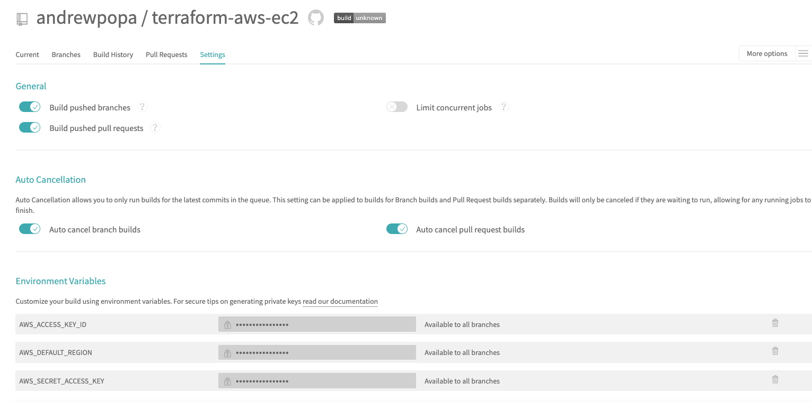

# terraform-aws-ec2
Terraform module to create ec2 resources on AWS

| **Branch**  | **Build status** |
| ------------- | ------------- |
| master  | [](https://travis-ci.org/andrewpopa/terraform-aws-ec2)  |

# Terraform version
This module was written and tested with Terraform v0.12.9 

# Assumptions
- You want to create security-group which will be attached to VPC and can be consumed by other resources inside VPC
- You have access to AWS console where you can create you security credentials `AWS_ACCESS_KEY_ID` and `AWS_SECRET_ACCESS_KEY`
- You configured your security credentials as your environment variables `~/.bash_profile` 

```bash
export AWS_ACCESS_KEY_ID=XXXX
export AWS_SECRET_ACCESS_KEY=XXXX
export AWS_DEFAULT_REGION=XXXX
```

# How to consume

## Dependencies
- [VPC](https://github.com/andrewpopa/terraform-aws-vpc) needs to be created - consumed as separate module
- [Security group](https://github.com/andrewpopa/terraform-aws-security-group) needs to be created - consumed as separate module
- [`example`](https://github.com/andrewpopa/terraform-aws-ec2/tree/master/example) folder contain an example of how to consume the module

```terraform
module "vpc" {
  source = "github.com/andrewpopa/terraform-aws-vpc"

  # VPC
  cidr_block          = "172.16.0.0/16"
  vpc_public_subnets  = ["172.16.10.0/24", "172.16.11.0/24", "172.16.12.0/24"]
  vpc_private_subnets = ["172.16.13.0/24", "172.16.14.0/24", "172.16.15.0/24"]
  vpc_tags = {
    vpc            = "my-aws-vpc"
    public_subnet  = "public-subnet"
    private_subnet = "private-subnet"
    internet_gw    = "my-internet-gateway"
    nat_gateway    = "nat-gateway"
  }
}

module "security-group" {
  source = "github.com/andrewpopa/terraform-aws-security-group"
  
  # Security group
  security_group_name       = "my-aws-security-group"
  security_group_description = "my-aws-security-group-descr"
  ingress_ports             = [22, 443, 8800, 5432]
  tf_vpc = module.vpc.vpc_id
}

module "ec2" {
  source = "../"
  subnet_id = module.vpc.private_subnets[0]
  vpc_security_group_ids = module.security-group.sg_id
  ami_type = "ami-0085d4f8878cddc81"
  ec2_instance = {
    type          = "m5.large"
    root_hdd_size = 50
    root_hdd_type = "gp2"
  }
  key_name = ""
  public_key = ""
  public_ip = false
  ec2_tags = {
    ec2 = "my-ptfe-instance"
  }
}
```

# Inputs
| **Name**  | **Type** | **Default** | **Required** | **Description** |
| ------------- | ------------- | ------------- | ------------- | ------------- |
| subnet_id | string | none | yes | Subnet ID for EC2 |
| vpc_security_group_ids | string | none | yes | VPC security Group ID |
| ami_type | string | Ubuntu | no | List of ingress ports |
| ec2_instance["type"] | map | m5.large | yes | ec2 instance type | 
| ec2_instance["root_hdd_size"] | map | 50 | yes | ec2 instance root hdd size | 
| ec2_instance["root_hdd_type"] | map | gp2 | yes | ec2 instance root hdd type | 
| key_name | string | none | no | key name |
| public_ip | string | none | no | public key |
| public_ip | bool | true | no | ec2 assign public ip |
| ec2_tags["ec2"] | map | my-ec2 | no | ec2 name tag |

# Outputs
| **Name**  | **Type** | **Description** |
| ------------- | ------------- | ------------- |
| ec2_public_ip | string | ec2 public ip |
| ec2_private_ip | string | ec2 private ip |
| ec2_ec2_dns | string | ec2 public aws dns |
| ec2_ec2_id | string | ec2 id |

# Testing
Module has implemented testing with [kitchen](https://kitchen.ci/) and [kitchen-terraform](https://newcontext-oss.github.io/kitchen-terraform/)

## Install locally

run in cli
```bash
echo 'export PATH="$HOME/.rbenv/bin:$PATH"' >> ~/.bash_profile
source ~/.bash_profile
rbenv init
echo 'eval "$(rbenv init -)"' >> ~/.bash_profile
source ~/.bash_profile
```

use 2.3.1 version 

```bash
rbenv install 2.3.1
rbenv local 2.3.1
```

check current version
```bash
rbenv version
```

output
```bash
2.3.1 (set by /Users/user/.ruby-version)
```

make sure you have you bundler installed `bundler version` with similar output

```bash
Bundler version 2.0.2 (2019-06-13 commit 496bca538)
```

or install it 

```bash
gem install bundler
```

install all required gems specified in `Gemfile`

```bash
bundle install
```

test the module

```bash
bundle exec kitchen converge
bundle exec kitchen verify
bundle exec kitchen destroy
```

## Remote
For remote testing [travis](https://travis-ci.org) is used with the same steps as local testing

- install dependencies via bundle install with `Gemfile`
- download and unzip terraform version 0.12.9
- terraform init
- execute kitchen test

### Assumptions
- You are logged in travis with your github account.
- Travis has access to you repository
- You have configured Environment variables for travis



### Releases on tags
```
travis setup releases
```

Will add releases information to yaml file. Releases can be triggered using tags.

# TODO
- [ ] add more terraform functionality
- [ ] add kitchen test with travis
